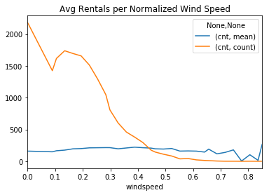

### Analysis of bike sharing rentals in Washington, DC.

Data set and data dictionary is found here:
http://archive.ics.uci.edu/ml/datasets/Bike+Sharing+Dataset


```python
import pandas as pd
import numpy as np
import matplotlib.pyplot as plt
import seaborn as sns
from sklearn.model_selection import train_test_split
from sklearn.linear_model import LinearRegression
from sklearn.metrics import mean_absolute_error, mean_squared_error
from xgboost import XGBRegressor
from sklearn.ensemble import RandomForestRegressor
%matplotlib inline
```


```python
bike_rentals = pd.read_csv('bike_rental_hour.csv')

# drop irrelevant columns
bike_rentals.drop(columns=['instant', 'temp'], inplace=True)
```


```python
# Combine month and year into one column
bike_rentals['year_month'] = (bike_rentals['yr'] * 12) + bike_rentals['mnth']
```


```python
print(bike_rentals.shape)
bike_rentals.head()
```

    (17379, 16)


<div>
<style scoped>
    .dataframe tbody tr th:only-of-type {
        vertical-align: middle;
    }

    .dataframe tbody tr th {
        vertical-align: top;
    }

    .dataframe thead th {
        text-align: right;
    }
</style>
<table border="1" class="dataframe">
  <thead>
    <tr style="text-align: right;">
      <th></th>
      <th>dteday</th>
      <th>season</th>
      <th>yr</th>
      <th>mnth</th>
      <th>hr</th>
      <th>holiday</th>
      <th>weekday</th>
      <th>workingday</th>
      <th>weathersit</th>
      <th>atemp</th>
      <th>hum</th>
      <th>windspeed</th>
      <th>casual</th>
      <th>registered</th>
      <th>cnt</th>
      <th>year_month</th>
    </tr>
  </thead>
  <tbody>
    <tr>
      <th>0</th>
      <td>2011-01-01</td>
      <td>1</td>
      <td>0</td>
      <td>1</td>
      <td>0</td>
      <td>0</td>
      <td>6</td>
      <td>0</td>
      <td>1</td>
      <td>0.2879</td>
      <td>0.81</td>
      <td>0.0</td>
      <td>3</td>
      <td>13</td>
      <td>16</td>
      <td>1</td>
    </tr>
    <tr>
      <th>1</th>
      <td>2011-01-01</td>
      <td>1</td>
      <td>0</td>
      <td>1</td>
      <td>1</td>
      <td>0</td>
      <td>6</td>
      <td>0</td>
      <td>1</td>
      <td>0.2727</td>
      <td>0.80</td>
      <td>0.0</td>
      <td>8</td>
      <td>32</td>
      <td>40</td>
      <td>1</td>
    </tr>
    <tr>
      <th>2</th>
      <td>2011-01-01</td>
      <td>1</td>
      <td>0</td>
      <td>1</td>
      <td>2</td>
      <td>0</td>
      <td>6</td>
      <td>0</td>
      <td>1</td>
      <td>0.2727</td>
      <td>0.80</td>
      <td>0.0</td>
      <td>5</td>
      <td>27</td>
      <td>32</td>
      <td>1</td>
    </tr>
    <tr>
      <th>3</th>
      <td>2011-01-01</td>
      <td>1</td>
      <td>0</td>
      <td>1</td>
      <td>3</td>
      <td>0</td>
      <td>6</td>
      <td>0</td>
      <td>1</td>
      <td>0.2879</td>
      <td>0.75</td>
      <td>0.0</td>
      <td>3</td>
      <td>10</td>
      <td>13</td>
      <td>1</td>
    </tr>
    <tr>
      <th>4</th>
      <td>2011-01-01</td>
      <td>1</td>
      <td>0</td>
      <td>1</td>
      <td>4</td>
      <td>0</td>
      <td>6</td>
      <td>0</td>
      <td>1</td>
      <td>0.2879</td>
      <td>0.75</td>
      <td>0.0</td>
      <td>0</td>
      <td>1</td>
      <td>1</td>
      <td>1</td>
    </tr>
  </tbody>
</table>
</div>


```python
bike_rentals['cnt'].hist(bins=20)
```


    <matplotlib.axes._subplots.AxesSubplot at 0x1a2e39c9e8>


![png]./images/output_5_1.png)


```python
bike_rentals.corr().sort_values(by='cnt', ascending=False)[['cnt']]
```


<div>
<style scoped>
    .dataframe tbody tr th:only-of-type {
        vertical-align: middle;
    }

    .dataframe tbody tr th {
        vertical-align: top;
    }

    .dataframe thead th {
        text-align: right;
    }
</style>
<table border="1" class="dataframe">
  <thead>
    <tr style="text-align: right;">
      <th></th>
      <th>cnt</th>
    </tr>
  </thead>
  <tbody>
    <tr>
      <th>cnt</th>
      <td>1.000000</td>
    </tr>
    <tr>
      <th>registered</th>
      <td>0.972151</td>
    </tr>
    <tr>
      <th>casual</th>
      <td>0.694564</td>
    </tr>
    <tr>
      <th>atemp</th>
      <td>0.400929</td>
    </tr>
    <tr>
      <th>hr</th>
      <td>0.394071</td>
    </tr>
    <tr>
      <th>year_month</th>
      <td>0.278580</td>
    </tr>
    <tr>
      <th>yr</th>
      <td>0.250495</td>
    </tr>
    <tr>
      <th>season</th>
      <td>0.178056</td>
    </tr>
    <tr>
      <th>mnth</th>
      <td>0.120638</td>
    </tr>
    <tr>
      <th>windspeed</th>
      <td>0.093234</td>
    </tr>
    <tr>
      <th>workingday</th>
      <td>0.030284</td>
    </tr>
    <tr>
      <th>weekday</th>
      <td>0.026900</td>
    </tr>
    <tr>
      <th>holiday</th>
      <td>-0.030927</td>
    </tr>
    <tr>
      <th>weathersit</th>
      <td>-0.142426</td>
    </tr>
    <tr>
      <th>hum</th>
      <td>-0.322911</td>
    </tr>
  </tbody>
</table>
</div>


```python
bike_rentals.groupby('hr').agg('sum')[['cnt']].plot.line(title='Rentals per Hour')
plt.show()

sns.scatterplot(x=bike_rentals['hr'], y=bike_rentals['cnt'])
```


    <matplotlib.axes._subplots.AxesSubplot at 0x1a2b8c34e0>


Hour of the day is very highly correlated with the number of rentals.  Let's see what happens if we group these into times of day.


```python
def time_label(hr):
    return int((hr - 1) / 6)

bike_rentals['time_of_day'] = bike_rentals['hr'].apply(time_label)

print(bike_rentals[['time_of_day','hr','cnt']].corr()['cnt'])

sns.scatterplot(x=bike_rentals['time_of_day'], y=bike_rentals['cnt'])
```

    time_of_day    0.385600
    hr             0.394071
    cnt            1.000000
    Name: cnt, dtype: float64


    <matplotlib.axes._subplots.AxesSubplot at 0x1a2b88c898>


Hour is actually more correlated with rentals than the generic time of day, but we'll leave "time_of_day" and see how it affects the model.


```python
bike_rentals.groupby('year_month').agg('sum')[['cnt']].plot.line(title='Rentals per Month')
```


    <matplotlib.axes._subplots.AxesSubplot at 0x1a2ead05f8>


Rentals are increasing significantly year to year.  Growth!


```python
bike_rentals.groupby('season').agg('sum')[['cnt']].plot.bar(title='Rentals per Season')
```


    <matplotlib.axes._subplots.AxesSubplot at 0x1a2eb272e8>


Surprisingly, spring has the least number of rentals.  This could be due to the increase in rentals over time, as rentals from December of the second year at the same as June of the first year.  Temperature is probably a more important factor.


```python
bike_rentals.groupby('weathersit').agg('mean')[['cnt']].plot.bar(title='Avg Rentals by Weather (lower weather value is nicer)')
plt.show()

sns.scatterplot(x=bike_rentals['weathersit'], y=bike_rentals['cnt'])
plt.show()

# As the numerical value increases, the weather gets worse (more rain/snow)
bike_rentals['weathersit'].value_counts()
```


    1    11413
    2     4544
    3     1419
    4        3
    Name: weathersit, dtype: int64


Not surprisingly, people like to bike in good weather.  We don't have a lot of data about really bad weather though, so that data may not be super helpful.  That being said, we all know riding in a thunderstorm is no fun, so we'll keep it.  Surprisingly, weather is not very highly correlated with the number of rentals.


```python
bike_rentals.groupby('windspeed').agg(['mean', 'count'])[['cnt']].plot.line(title='Avg Rentals per Normalized Wind Speed')
```


    <matplotlib.axes._subplots.AxesSubplot at 0x1a2edd73c8>





Wind doesn't really become much of a factor unless we have high winds.  We'll create a boolean column to specify whether it's significantly windy or not.


```python
bike_rentals['windy'] = bike_rentals['windspeed'] > 0.7
```


```python
bike_rentals.groupby('mnth').agg('count')['cnt'].plot.bar()
```


    <matplotlib.axes._subplots.AxesSubplot at 0x1a2f0cd860>


Just making sure that we have data for all months, and it doesn't look like we're missing many days (if any).

# Model Creation


```python
# Make sure that the splits have equal distributions of data per month/year
feature_cols = ['atemp','hr','yr','mnth','year_month', 'windy',
                'season','holiday','weekday','workingday','weathersit','hum','windspeed','time_of_day']
x_train, x_test, y_train, y_test = train_test_split(
    bike_rentals[feature_cols], bike_rentals['cnt'], test_size=0.2, stratify=bike_rentals['year_month']
)
```

## Linear Regression


```python
lr = LinearRegression()
lr.fit(x_train, y_train)

predictions = lr.predict(x_train)
mae_train = mean_absolute_error(predictions, y_train)
mse_train = mean_squared_error(predictions, y_train)
print('MAE train: ' + str(mae_train))
print('MSE train: ' + str(mse_train))

predictions = lr.predict(x_test)
mae_test = mean_absolute_error(predictions, y_test)
mse_test = mean_squared_error(predictions, y_test)
print('MAE test: ' + str(mae_test))
print('MSE test: ' + str(mse_test))

combined = pd.DataFrame({'cnt': y_test, 'predicted_count': predictions, 'error': predictions - y_test})
combined[['error','cnt']].hist()
```

    MAE train: 105.22108186741931
    MSE train: 19899.632378751474
    MAE test: 107.11235521477506
    MSE test: 20949.858486599594


    array([[<matplotlib.axes._subplots.AxesSubplot object at 0x1a2f05a828>,
            <matplotlib.axes._subplots.AxesSubplot object at 0x1a2ef5cf98>]],
          dtype=object)


## XGBoost


```python
xg = XGBRegressor(n_estimators=200, min_samples_leaf=5)
xg.fit(x_train, y_train)

predictions = xg.predict(x_train)
mae_train = mean_absolute_error(predictions, y_train)
mse_train = mean_squared_error(predictions, y_train)
print('MAE train: ' + str(mae_train))
print('MSE train: ' + str(mse_train))

predictions = xg.predict(x_test)
mae_test = mean_absolute_error(predictions, y_test)
mse_test = mean_squared_error(predictions, y_test)
print('MAE test: ' + str(mae_test))
print('MSE test: ' + str(mse_test))

combined = pd.DataFrame({'cnt': y_test, 'predicted_count': predictions, 'error': predictions - y_test})
combined[['error','cnt']].hist()
```

    /Users/jkruger/anaconda3/lib/python3.7/site-packages/xgboost/core.py:587: FutureWarning: Series.base is deprecated and will be removed in a future version
      if getattr(data, 'base', None) is not None and \


    [15:18:33] WARNING: src/objective/regression_obj.cu:152: reg:linear is now deprecated in favor of reg:squarederror.
    MAE train: 38.72326178433423
    MSE train: 3285.1513357306912
    MAE test: 40.857939170602755
    MSE test: 3533.560417936258


    array([[<matplotlib.axes._subplots.AxesSubplot object at 0x1a2a7fc978>,
            <matplotlib.axes._subplots.AxesSubplot object at 0x1a28129048>]],
          dtype=object)


## Random Forest


```python
rf = RandomForestRegressor(n_estimators=200, min_samples_leaf=5)
rf.fit(x_train, y_train)

predictions = rf.predict(x_train)
mae_train = mean_absolute_error(predictions, y_train)
mse_train = mean_squared_error(predictions, y_train)
print('MAE train: ' + str(mae_train))
print('MSE train: ' + str(mse_train))

predictions = rf.predict(x_test)
mae_test = mean_absolute_error(predictions, y_test)
mse_test = mean_squared_error(predictions, y_test)
print('MAE test: ' + str(mae_test))
print('MSE test: ' + str(mse_test))

combined = pd.DataFrame({'cnt': y_test, 'predicted_count': predictions, 'error': predictions - y_test})
combined[['error','cnt']].hist()
```

    MAE train: 19.88864927784966
    MSE train: 1152.3899771320048
    MAE test: 27.031594968817025
    MSE test: 1882.4319180407144


    array([[<matplotlib.axes._subplots.AxesSubplot object at 0x1a2ef46390>,
            <matplotlib.axes._subplots.AxesSubplot object at 0x1a282076d8>]],
          dtype=object)


Random Forest looks like the best algorithm for this problem.
